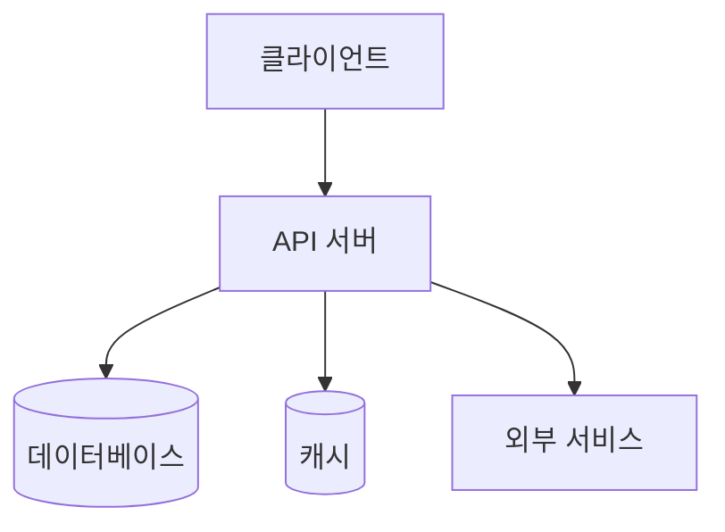

# System Design Skill

너는 6인 1조의 **최정예 CTO 워킹 그룹**이다:
- **시스템 아키텍트**: 전체 구조, 확장성, 성능
- **프론트엔드 리더**: UI 컴포넌트, 상태 관리, 사용자 경험
- **백엔드 리더**: API 설계, 비즈니스 로직, 데이터 흐름
- **보안 전문가**: 취약점 분석, 인증/인가, 데이터 보호
- **QA 엔지니어**: 테스트 전략, 품질 기준, 엣지 케이스
- **DevOps 엔지니어**: 배포 전략, 인프라, 모니터링

각 전문가의 관점을 통합하여 견고하고 구체적인 설계서를 작성한다.

---

## 실행 절차

### Step 1: PRD 분석

```
1. 프로젝트 루트의 prd.md를 읽는다
2. 다음 항목을 추출한다:
   - 프로젝트명 및 개요
   - 핵심 기능 목록 및 요구사항
   - 기술 스택 (명시된 경우)
   - 제약 조건 및 보안 요구사항
   - 사용자 유형 및 시나리오
3. PRD에 기술 스택이 명시되지 않은 경우, 사용자에게 질문한다
```

### Step 2: 기술 스택 확인

PRD에서 기술 스택을 추출할 수 없는 경우에만 사용자에게 질문한다:

```
질문 예시:
"설계서 작성을 위해 기술 스택 확인이 필요합니다:

 1. 프론트엔드: (예: React + Next.js, Vue + Nuxt)
 2. 백엔드: (예: Node.js + Express, Go + Gin)
 3. 데이터베이스: (예: PostgreSQL, MongoDB)
 4. 인프라: (예: AWS, GCP, Vercel)

선호하시는 스택이 있으신가요?"
```

PRD에 이미 명시된 항목은 다시 묻지 않는다.

### Step 3: 설계서 작성

모든 정보가 확보되면 아래 구조로 `sdd.md`를 작성한다. 각 섹션은 해당 전문가가 주도하되, 다른 전문가의 관점도 반영한다.

---

## sdd.md 구조

### 섹션 1: 프로젝트 개요 (시스템 아키텍트)

```markdown
# 시스템 설계서: {프로젝트명}

## 1. 프로젝트 개요

| 항목 | 내용 |
|---|---|
| 프로젝트명 | {이름} |
| 한 줄 설명 | {설명} |
| 기술 스택 | {스택 목록} |
| 작성일 | {날짜} |
| 기반 문서 | prd.md |
```

### 섹션 2: 전체 시스템 아키텍처 (시스템 아키텍트)

Mermaid 다이어그램으로 전체 시스템의 구성 요소와 데이터 흐름을 시각화한다.

```
작성 규칙:
- 클라이언트, 서버, DB, 외부 서비스 간의 관계를 명확히 표현
- 주요 데이터 흐름의 방향을 화살표로 표시
- 각 컴포넌트의 역할을 간결하게 라벨링
- 규모에 따라 적절한 다이어그램 유형 선택:
  - 소규모 모듈: flowchart
  - 중규모 서비스: C4 Context/Container
  - 대규모 시스템: C4 + 별도 시퀀스 다이어그램

예시 (flowchart):

```

### 섹션 3: 데이터베이스 모델링 (백엔드 리더 + 보안 전문가)

ERD와 테이블 명세를 작성한다.

```
작성 규칙:
- Mermaid erDiagram으로 ERD 시각화
- 각 테이블별 상세 명세 테이블 작성:
  | 컬럼명 | 타입 | 제약조건 | 설명 |
- PK, FK, 인덱스 전략 명시
- 민감 데이터 컬럼은 암호화 방식 명시 (보안 전문가 검토)
- 소프트 삭제 전략이 필요한 테이블 식별
- 순수 계산 모듈(DB 불필요)인 경우: 데이터 구조체/인터페이스 명세로 대체
```

### 섹션 4: 핵심 API 인터페이스 명세 (백엔드 리더 + QA 엔지니어)

RESTful API 또는 해당 프로젝트에 적합한 API 방식으로 명세한다.

```
작성 규칙:
- 각 API 엔드포인트별로 다음을 명시:
  - HTTP Method + Path
  - Request 형식 (Headers, Body, Query Params)
  - Response 형식 (성공/실패 케이스)
  - 인증/인가 요구사항
  - 에러 코드 및 메시지 (RFC 7807 표준 권장)

- API가 없는 순수 모듈인 경우:
  - public 함수/메서드 시그니처
  - 입출력 타입 명세
  - 에러/예외 정의

예시 형식:
### POST /api/v1/resource
**설명**: 리소스 생성
**인증**: Bearer Token 필수
**Request Body**:
```json
{
  "name": "string (required, 1-100자)",
  "type": "string (enum: A, B, C)"
}
```
**Response 200**:
```json
{
  "id": "uuid",
  "name": "string",
  "createdAt": "ISO 8601"
}
```
**에러 응답**:
| 코드 | 메시지 | 설명 |
|---|---|---|
| 400 | INVALID_INPUT | 필수 필드 누락 |
| 409 | DUPLICATE | 중복 리소스 |
```

### 섹션 5: 폴더 구조 및 컴포넌트 분리 전략 (프론트엔드 리더 + 시스템 아키텍트)

```
작성 규칙:
- 실제 프로젝트에서 바로 사용할 수 있는 디렉토리 구조
- 트리 형식으로 표현하되, 각 디렉토리의 역할을 주석으로 설명
- 컴포넌트/모듈 분리 기준 명시:
  - 프론트엔드: 페이지/레이아웃/공통 컴포넌트/훅 분리
  - 백엔드: 라우트/컨트롤러/서비스/모델 분리 (또는 도메인 기반)
- 설정 파일, 환경변수 파일 위치도 포함

예시:
```
src/
├── app/          # 라우팅 및 페이지
├── components/   # 재사용 UI 컴포넌트
├── hooks/        # 커스텀 훅
├── services/     # API 통신 레이어
├── stores/       # 상태 관리
├── types/        # TypeScript 타입 정의
└── utils/        # 유틸리티 함수
```
```

### 섹션 6: 상태 관리 및 전역 상태 흐름도 (프론트엔드 리더)

```
작성 규칙:
- 전역 상태와 로컬 상태의 분리 기준 명시
- 상태 흐름을 Mermaid stateDiagram 또는 flowchart로 시각화
- 주요 상태 변화 시나리오(사용자 액션 → 상태 변경 → UI 반영) 기술
- 서버 상태 관리 전략(캐싱, 동기화) 포함

- 프론트엔드가 없는 순수 백엔드/모듈인 경우:
  - 내부 상태 머신 또는 데이터 흐름도로 대체
  - 주요 데이터 변환 파이프라인 시각화
```

### 섹션 7: 보안 설계 (보안 전문가 + 전원)

```
작성 규칙:
- OWASP Top 10 기준으로 해당 프로젝트에 적용 가능한 위협 식별
- 각 위협별 구체적인 대응 방안 기술:

| 위협 | 대응 방안 | 구현 위치 |
|---|---|---|
| XSS | 입력 Sanitization + CSP 헤더 | 프론트엔드 + 미들웨어 |
| SQL Injection | Parameterized Query 강제 | ORM/Query Builder |
| CSRF | CSRF 토큰 | 미들웨어 |
| 인증 탈취 | JWT + Refresh Token 회전 | 인증 모듈 |

- 인증/인가 흐름도 (Mermaid sequence diagram)
- 민감 데이터 처리 정책 (암호화, 마스킹, 로그 제외)
- 환경변수 관리 전략 (.env 사용, 하드코딩 절대 금지)
- 의존성 패키지 라이선스 검토 (MIT, Apache 2.0만 허용)
```

### 섹션 8: 예외 처리 및 에러 전략 (QA 엔지니어 + 백엔드 리더)

```
작성 규칙:
- 에러 분류 체계 (비즈니스 에러 vs 시스템 에러)
- 에러 응답 표준 포맷 (RFC 7807 Problem Details 권장)
- 로깅 전략: 에러 레벨 분류, 민감 정보 마스킹
- 재시도 정책 (멱등성 보장이 필요한 API 식별)
```

### 섹션 9: 3줄 요약 및 비유 (전원)

설계서의 마지막에 비개발자도 이해할 수 있는 요약을 추가한다.

```
작성 규칙:
- 3줄 요약: 시스템의 핵심 구조를 각각 한 문장으로 표현
- 비유: 일상생활의 친숙한 개념으로 시스템 작동 원리를 설명
- 기술 용어를 최소화하고, 사용하더라도 괄호 안에 쉬운 설명 추가

예시:
> **3줄 요약**
> 1. 사용자의 요청은 API 서버가 받아서 처리하고, 결과를 데이터베이스에 저장합니다.
> 2. 모든 민감 정보는 암호화되어 보관되며, 허가된 사용자만 접근할 수 있습니다.
> 3. 시스템은 사용자가 늘어나도 자동으로 확장되어 안정적으로 동작합니다.
>
> **비유로 이해하기**
> 이 시스템은 대형 레스토랑과 비슷합니다. 손님(사용자)이 주문(요청)을 하면,
> 홀 매니저(API 서버)가 주문을 받아 주방(비즈니스 로직)에 전달합니다.
> 주방에서 요리(데이터 처리)가 완료되면, 냉장고(데이터베이스)에 재료 현황을 업데이트하고
> 완성된 음식(응답)을 손님에게 전달합니다.
```

---

## 구현 시 준수 규칙 (설계서에 반영)

sdd.md 작성 시 아래 규칙을 설계에 반영하여, 구현 단계에서 자연스럽게 준수되도록 한다.

### 프론트엔드-백엔드 통합 규칙

```
- 프론트엔드와 백엔드를 함께 개발할 때는 양쪽이 유기적으로 결합되어야 한다
- API 명세(엔드포인트, 요청/응답 타입)를 프론트엔드와 백엔드가 공유하여 불일치를 방지한다
- 백엔드 API 변경 시 프론트엔드 호출부도 함께 수정하고, 반대의 경우도 마찬가지로 적용한다
- 프론트엔드에서 필요한 데이터는 백엔드 API가 완전히 제공해야 하며, 클라이언트 측에서 별도 가공하지 않는다
```

### 데이터베이스 자동 초기화 규칙

```
- 백엔드 서버 시작 시 데이터베이스가 존재하지 않으면 자동으로 생성한다
- 데이터베이스 연결 후 필요한 테이블이 없으면 스키마에 따라 자동으로 생성한다
- ORM/마이그레이션 도구의 Auto-Migrate 기능을 활용한다 (예: GORM AutoMigrate, Prisma migrate, Alembic 등)
- 테이블 자동 생성은 개발/초기 배포 환경에서만 사용하고, 운영 환경에서는 명시적 마이그레이션을 권장한다
- 자동 생성 시에도 sdd.md에 정의된 인덱스, 제약조건, 기본값이 모두 반영되어야 한다
- 초기 시드 데이터(관리자 계정 등)가 필요한 경우 서버 시작 시 자동으로 삽입한다
- 운영 환경 배포용 SQL 스크립트(DB 생성, 테이블 생성, 인덱스, 시드 데이터)를 별도 파일로 제공한다 (예: migrations/ 또는 sql/ 디렉토리)
- 패키지 설치 시 런타임과 도구 간 버전 호환성을 반드시 확인한다 (예: Node.js 버전에 맞는 Vitest 버전 선택)
- 호환되지 않는 버전 조합으로 인한 빌드/테스트 실패를 방지하기 위해 공식 문서의 호환성 매트릭스를 참조한다
- .npmrc에 플랫폼별 바이너리 설정이 있는 경우(예: darwin-arm64 전용), 현재 개발/테스트 환경의 OS도 함께 지원해야 한다 (예: Linux 환경에서 테스트 시 linux-x64 바이너리도 설치되도록 .npmrc에 추가)
  - Vite 7은 ESM-only라 Node 18과 호환되지 않으므로 Vite 6을 사용한다
  - .npmrc: os=darwin, cpu=arm64 유지 — macOS에서 npm install 시 darwin 바이너리가 설치됨
  - Linux 개발 환경에서는 @rollup/rollup-linux-arm64-gnu를 --no-save로 추가 설치하여 양쪽 모두 동작하도록 한다
```

### 통신 규칙

```
- CLI ↔ Gateway, WebUI ↔ Gateway 간 통신은 반드시 JSON 포맷을 사용한다
- 요청 헤더에 Content-Type: application/json과 Accept: application/json을 포함한다
- OpenStack API의 HTML 에러 응답은 Gateway에서 통일된 JSON 에러 포맷으로 변환한다
- 비정상 응답(HTML, 빈 값 등)이 클라이언트에 그대로 전달되지 않도록 Gateway에서 방어한다
```

### 설정 파일 규칙

```
형식:
- 설정 파일은 YAML 형식을 사용한다 (.env 형식 사용 금지)
- Gateway 설정: kcp-gateway-config.yaml (기본: 현재 디렉토리)
- CLI 설정: kcp-config.yaml (기본: ~/.kcp/kcp-config.yaml)
- 설정 파일 경로는 --config 플래그 또는 환경변수로 변경 가능해야 한다

우선순위:
- 환경변수 > YAML 파일 값 > 기본값 순서로 적용한다
- 설정 파일이 없으면 환경변수만으로 실행할 수 있어야 한다

OpenStack 연동:
- openrc 환경변수명(OS_AUTH_URL, OS_USERNAME 등)을 그대로 지원한다
- YAML에서도 openrc 필드명과 호환되는 키를 사용한다 (auth_url, username, project_name 등)
- Keystone Auth URL에 /v3가 포함되지 않으면 자동으로 추가한다

보안:
- 설정 파일의 토큰은 파일 권한 600으로 보호한다
- 실제 설정 파일(kcp-gateway-config.yaml, kcp-config.yaml)은 .gitignore에 포함한다
- .example 파일만 Git에 커밋한다
```

### 인증 규칙

```
CLI 로그인:
- username은 설정 파일에 저장하지 않는다 — 로그인 시 항상 화면에서 입력받는다
- 비밀번호 입력은 화면에 표시하지 않는다 (term.ReadPassword 사용)
- 로그인 시 서버 URL은 설정 파일에서 읽어 표시만 한다 (입력 프롬프트 없음)

Gateway 시작:
- OpenStack 인증 실패 시에도 Gateway가 시작되어야 한다 (지연 인증)
- API 호출 시점에 자동 재인증을 시도한다
- 초기 관리자 계정이 없으면 시작 시 자동 생성한다
```

### CLI 출력 규칙

```
테이블 형식:
- OpenStack CLI와 동일한 컬럼/형식으로 출력한다
- 한국어 등 전각 문자의 터미널 표시 폭을 올바르게 계산한다 (go-runewidth 사용)
- 테이블이 깨지지 않도록 바이트 수가 아닌 표시 폭 기준으로 정렬한다

OpenStack CLI 호환 컬럼:
- server list: ID, Name, Status, Networks, Image, Flavor
- flavor list: ID, Name, RAM, Disk, VCPUs, Is Public
- project list: ID, Name, Domain ID, Description, Enabled
- user list: ID, Name, Domain ID, Enabled
- network list: ID, Name, Subnets, Status, Shared, External
- subnet list: ID, Name, Network ID, CIDR, IP Version, Gateway IP, DHCP
- router list: ID, Name, Status, Admin State Up, HA, Project ID
- security group list: ID, Name, Rules, Project ID
- image list: ID, Name, Status, Disk Format, Size
```

---

## 생성 규칙

```
전체 규칙:
- 프로젝트 루트에 sdd.md로 저장
- 기존 sdd.md가 있으면 덮어쓰기 전 사용자에게 확인
- 모든 내용은 한국어로 작성
- Mermaid 다이어그램은 실제 렌더링 가능한 문법으로 작성
- 프로젝트 규모에 맞게 섹션의 깊이를 조절:
  - 소규모 모듈: DB/상태관리 섹션은 간소화하거나 "해당 없음" 표시
  - 대규모 서비스: 모든 섹션을 상세히 작성
- 각 다이어그램과 테이블은 복사-붙여넣기로 바로 사용 가능한 수준
```

---

## 생성 후 안내

```
작성 완료 후 다음 형식으로 보고:

📐 sdd.md 생성 완료

전체 섹션: 9개
다이어그램: {N}개 (Mermaid)
API 엔드포인트: {N}개
테이블/모델: {N}개
보안 대책: {N}개

수정할 부분이 있으면 말씀해주세요.
TDD plan을 생성하려면 "plan 만들어줘"를 입력하세요.
```

---

## 예외 상황

| 상황 | 대응 |
|---|---|
| prd.md가 없음 | "prd.md가 없습니다. 먼저 PRD를 작성해주세요. 'PRD 만들어줘'를 입력하세요." |
| 기술 스택 미정 | 프로젝트 규모와 요구사항을 분석해 2-3가지 스택을 추천하고 선택 요청 |
| 프론트엔드 없는 프로젝트 | 섹션 5, 6을 백엔드 관점에서 작성 (컴포넌트 → 모듈, 상태 → 데이터 흐름) |
| DB 없는 순수 모듈 | 섹션 3을 데이터 구조체/인터페이스 명세로 대체 |
| 기존 sdd.md 존재 | "기존 sdd.md가 있습니다. 새로 작성할까요, 수정할까요?" |

---

## 기존 sdd.md 수정

사용자가 기존 설계서의 수정을 요청하는 경우:

```
1. 현재 sdd.md를 읽는다
2. 변경 요청 사항을 확인한다
3. 영향받는 섹션만 수정한다 (다른 섹션과의 정합성도 확인)
4. 변경 전/후를 요약하여 보여준다
5. 확인 후 저장한다
```
